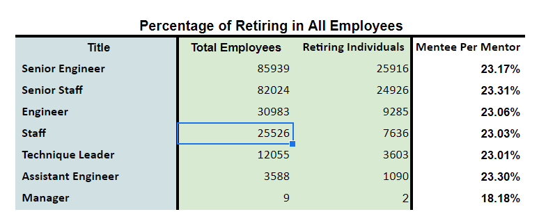
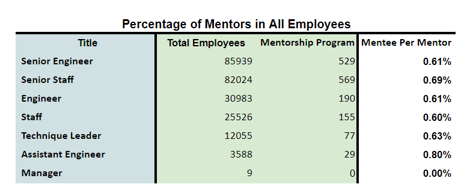
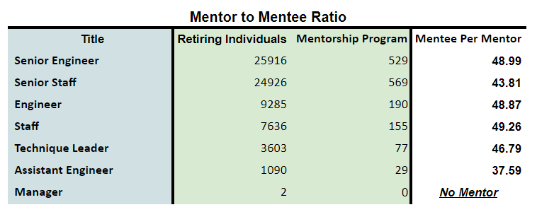

# Employee Retirement Analysis: Mentorship Program
 
## Introduction
The purpose of this analysis is to help the company understand their expected silver tsunami and possible mentors that are present. In addition to that I have provided information on how to proceed from here on forward.
 
## Results
Here are the results that we were able to conclude:
 
### Number of Retiring Employees

>Here we can see that across the board roughly 23% of the employees are reaching retirement.
 
### Number of Mentors Employees

>Here we can see that across the board we have <1% of our employees being eligible to be a mentor.
 
### Mentorship Data

>Based on the current count of mentors, each mentor would need to mentor 37-50 mentees to be able to sustain their employee numbers.
 
### Additional Notes
- Looking at these tables, we see that as the plan currently stands, we would be needing mentors to play the role of a teacher, not of a mentor.
 
## Summary
Looking at our data we can conclude some immediate observations. We have over 70K employees retiring, which makes up for 23.18% of the total employee population. Yet our mentors only make .64% of the employees. To offset this discrepancy each employee would need to have up to 50 mentors each to help recover. Based on the current criteria this is not possible. We should change the criteria to resemble an experience based mentorship. One table that would be helpful would be a list of individuals who have worked in the company or in their specific role for 10-15+ years which seems like a reasonable criteria for mentorship. In addition to that, look to have a larger number of leadership titles take on mentorship as they should have significant knowledge of positions below them i.e Senior Engineer <> Engineer.
